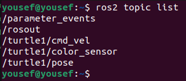
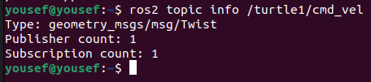

# Robot Operating System (ROS2)

This is part 1 of ROS2 tutorial. In this file we will explore the very basics of ROS2 and to better understand the various concepts that we are encountering we will use a project-based approach and we will use practical examples along the way. This file will cover mostly the theoritical side of the concepts and we will learn what is ROS2 and how things work in it.

This file will cover the following topics:

1. Installing and sourcing ROS2
2. ROS2 workspaces, packages, and nodes
3. ROS2 communication methods
4. basics of rqt tool
5. Applying on turtlesim

This is a quick overview and a small demo on ROS2. members reading this demo are assumed to have basic information about ROS as a concept and how it's used in autonomous systems and robotics in general.

To put it into prespective ROS2 is just a framework that help us connecting all the various aspects of robotics such as perception, planning and control. In simple terms if you have a robot how do you make the sensors and the main control unit mounted on the robot communicate. here comes ROS2 to provide us with some tools and libraries to make this communication easy.

The main resource to better understand what is ROS2 and how to get started with it is ROSwiki. here is the link: [https://docs.ros.org/en/humble/](https://docs.ros.org/en/humble/)

> Note that this docs is for ROS2 humble which is the most stable and famous version at the time that this file was written

---

### Installing ROS2

First thing we do is open a terimnal and copy these commands one by one. You don't have to understand exactly what they're doing for now abd we will just focus on installing it.

```bash
sudo apt update && sudo apt install locales

sudo locale-gen en_US en_US.UTF-8

sudo update-locale LC_ALL=en_US.UTF-8 LANG=en_US.UTF-8

export LANG=en_US.UTF-8

sudo apt install software-properties-common

sudo add-apt-repository universe

sudo apt update && sudo apt install curl -y

sudo curl -sSL https://raw.githubusercontent.com/ros/rosdistro/master/ros.key -o /usr/share/keyrings/ros-archive-keyring.gpg
echo "deb [arch=$(dpkg --print-architecture) signed-by=/usr/share/keyrings/ros-archive-keyring.gpg] http://packages.ros.org/ros2/ubuntu $(. /etc/os-release && echo $UBUNTU_CODENAME) main" | sudo tee /etc/apt/sources.list.d/ros2.list > /dev/null

sudo apt update

sudo apt upgrade

sudo apt install ros-humble-desktop

source /opt/ros/humble/setup.bash

```

---

### Sourcing ROS2

After you open the wiki and get on with the installation you will notice something important that every time you open a terminal and you want to work with ROS2 you will have to add this command at the start of the terminal session:

```bash
source /opt/ros/humble/setup.bash
```

To save yourself the trouble of writing down this command every time. you can use the **`.bashrc`** file to do it for you.

**`.bashrc`** file is a file that runs once you open a terminal session. for example your home directory have a **`.bashrc`** file with some **bash** code in it that sets up the environment of your machine for you. You can read more about **`.bashrc`** files here if you want: [https://www.digitalocean.com/community/tutorials/bashrc-file-in-linux](https://www.digitalocean.com/community/tutorials/bashrc-file-in-linux)

Anyways all that we need to know is that this file runs once we open a new terminal session and it contains **bash** code (commands are considers bash code). so all we have to do is add our command to the **`.bashrc`** file and we won't bother doing this command every time we open a new shell. But how do we do this.

1. we open a new shell and make sure we are in the home directory.
2. then use this command to open the **`.bashrc`** file.

```bash
gedit .bashrc
```

3. then we add this line at the end of the file and save.

```bash
source /opt/ros/humble/setup.bash
```

There is an alternative way to do this in one step using this command:

```bash
echo "source /opt/ros/humble/setup.bash" >> ~/.bashrc
```

Voila you have sources you ROS for good.

---

### Basics of ROS2

We will start our journey in ROS2 by installing turtlesim since this is the simplest project that will help us grasp all the concepts that we want to discover in this demo.

we will install turtlesim by using this command

```bash
sudo apt install ros-humble-turtlesim
```

To get something running and encourage you to continue this tutorial we can run this:

```bash
ros2 run turtlesim turtlesim_node
```

Ok let's break down this command.

* **ros2** indicates that we are typing a command related to ros2 and every ros command that will use from now on will begin with ros2
* the **run** command lets us run cartain nodes in our workspace
* **turtlesim** is the `name of the package` that has the node that we want to use
* **turtlesim_node** is the `node name` that we ran

ok now propably you have more questions such as what is the meaning of package, workspace and node. Let's discuss these terms briefly and we will come back to the program that we just opened.

**Workspace:** is a directory that have different packages in it. think of it as the container that holds all the different aspects and tools for you project.

**Package:** is a subdirectory in the workspace container that contains different nodes related to on specific job.

**Node:** is the building block of the entire system and it refers to a certain file (script) that is responsibel for a specific task.

Let's take an example to make things more clear. Let's say we want to start a new project on autonomous exploration robot. we will start by creating a workspace to hold everything related to this project (we will learn how to create a workspace later in this demo). after we've created our workspace we need to define the main components of our task for example our robot will have a camera that we will use to identify certain objects. this is perception so we will create a package to hold all files related to perception (we will learn how to create a package later in this demo). another package for mapping, another for environment and robot model, etc. Now let's start working on these packages. We find for example in the planning package that we have a lot of tasks such as local planning, global planning, localization, trajectory, etc. So we will create a node (we will learn how to create a node later in this demo) for each task to focus on it.

Ok now we have a better view of the system so far. but remember what we said before the power of ROS lies in **connecting** and providing **communication** between all these different nodes in the system. so how exactly does ROS helps us with this task. that's what we will learn in the following sections.

---

### Moving the turtle

Now let's continue where we left off. we started turtlesim node and there is a turtel hanging around our screen. how about we make this turtle move. How can we do this you ask. By running another node that is responsible for the movement of the turtle. In another shell run this command

```bash
ros2 run turtlesim turtle_teleop_key
```

Now if you use you arrow keys in your keyboard you will move the turtle. first notice that we ran another node from the same package as the last node which is turtlesim package.

Ok let us understand how does these two nodes work and how are they talk to each other.

There are three main types of communication that ROS provides **topics**, **services**, and **actions.** Let's explain them briefly for now and later we will provide a detailed explaination of each one of them.

#### Topics

is a channel that nodes can send data to and recieve data from. the nodes that sends data to a topic are called **`publishers`** and the nodes that listnes for this data are called **`subscribers`**. A node can have multiple publishers and subscribers.


In our example we used two nodes turtlesim_node and turtle_teleop_key. these two nodes communicate with each other through a topic called cmd_vel. ok how did we know this information and how is this topic enable us to move the robot like that.

In a new terminal run the following command:

```bash
ros2 node list
```

this will list all the active nodes which will result in the two nodes that we already ran before. next we run this command.

```bash
ros2 topic list
```

This will list all the topics that the that these two nodes have created.



here we find the topic that we mentioned before **`cmd_vel`** and when we run the following command:

```bash
ros2 topic info /turtle1/cmd_vel
```

we get this.



which indicates that there is one publisher and one subscriber that are connected to this topic. we also notice the type of the topic which indicate the type of the message that is being transported through this topic.

if you want to learn more about the type of a message we can run this command:

```bash
ros2 interface show geometry_msgs/msg/Twist
```

this will provide us with some information about the message.


ok now we understand what are turtle_teleop_key sending to turtlesim_node. It's sending linear and angular velocities in 3 dimention space.

back to our nodes. If we want to get more inforamtion about a node we can run:

```bash
ros2 node info /turtlesim 
```

This will give us all sorts of information about the node.


we can see here that this node is subscribing to the cmd_vel topic that's why it could connect to the turtle_teleop_key node.

Now that we understand how to run nodes and how they can communicate with each other how about we try giving a direct command to the turtlesim_node through the terminal. Let's try this following command:

```bash
ros2 topic pub --once /turtle1/cmd_vel geometry_msgs/msg/Twist "{linear: {x: 2.0, y: 0.0, z: 0.0}, angular: {x: 0.0, y: 0.0, z: 1.8}}"
```

the pub command let's us publich a message directly to a topic that we choose and we also need to provide the message type and finally the content of the message. we added the **`--once`** flag to only publish one message if we didn't add this flag the command will loop until we stop it.

We should have a better understanding for the topics, publishers, and subscribers by now so let's learn a new tool that ROS provides to help us visualize this process.

---

#### rqt

rqt is a tool that we use to visualize and interact with the different components of the our system.

Let's start by downloading rqt

```bash
sudo apt install '~nros-humble-rqt*'
```

After the installation let's start with a simple command that rqt provides:

```bash
ros2 run rqt_graph rqt_graph
```

this command will open a new window and display to us the active nodes and the topics related to them and what are the publishers and subscribers of each topic.


---

### Spawning new turtle

Now it's time to learn about the second communication method in ROS which is services.

#### Services

Services are the second communication method that is introduced in ROS and it works based on a request and response type. meaning that the client sends a request to the server and the server handles this request and get back with the output to the client.

Services are less common compared to topics in most cases but there are many situations that it's prefered to use services instead of topics. Let's say for example that we want our robot to perform a certain move for example blink when it sees a red obstacle on an obstacle course. we can create a topic that listens for any obstacles and filter for the red ones and take the action required, but this can be computaionally expensive and time latency may appear. Instead we can create a service that we can only call when a red obstacle is detected.

Services may still a bit blurry for you but with some practical use, we will get used to it.

These following illustrations may help clear things up for you a little.


Ok let's try to use a service in our example. right now we have the turtlesim node running and we already closed turtle_teleop_key.

Let's try to run this following command and see what we get:

```bash
ros2 service call /spawn turtlesim/srv/Spawn "{x: 5.0, y: 5.0, theta: 0.0, name: 'my_turtle'}"
```

Let's break it down and learn what this command do.

First thing we notice that we used the service command since we are dealing with services. followed up by the call command which enables us to call this service. After that we wrote /spawn which is the service name. then we added the type of the service which is turtlesim/srv/Spawn (something like the message type when we used topics). last thing we add the parameters that this service needs in our case the params were the pose of the turtle and the name of it.

If we look at the turtlesim_node window we notice that there is another turtle that have been spawned and if we list the topics we will find that there are additional topics for the new turtle.


And if we use the pub command that we used before but change the topic name we can control the second turtle.

Notice also that we can use the list command for the services as we did for the topics before.

```bash
ros2 service list
```

There is also an important command for the services whis is **type**

```bash
ros2 service type /spawn
```

before we move on to the next step let's look for a second at the output that is shown on the screen when we used the call command earlier. It looks like this

```bash
requester: making request: turtlesim.srv.Spawn_Request(x=5.0, y=5.0, theta=0.0, name='my_turtle')

response:
turtlesim.srv.Spawn_Response(name='my_turtle')
```

We notice here that there is a requester which was us when we send the command and we gave it the parameters shown. and we got the response from the service which says that there is a turtle that have been spawned with the name my_turtle.

How about we try another service to deepen our understanding of services. Let's use service list to see what other services that we can play with.


Let's make the turtles teleport to a certain position. To do this we will use the teleport_absolute or teleport_relative services. We can choose which turtle do we want to teleport. Let's try these commands:

```bash
ros2 service call /turtle1/teleport_absolute turtlesim/srv/TeleportAbsolute "{x: 5.5, y: 7.0, theta: 1.57}"
ros2 service call /my_turtle/teleport_relative turtlesim/srv/TeleportRelative "{linear: 3.0, angular: 1.57}"
```

And just like that you are able to control the postition of the turtles with simple commands. But the important question what happens if we ran the turtle_teleop_key. which turtle do we control or do we control them both at the same time.

Why don't we try and find out for ourselves. Let's run turtle_teleop_key that we ran before.

We notice here that we only control the first turtle which is spawned by default, but why is that and how is this happening.

In simple terms it's because the default topic that the turtle_teleop_key publishes to is /turtle1/cmd_vel. so if we want to control the new turtle that we have spawned all we need to do is to change the topic that we publish to. So how do we change the argument that turtle_teleop_key uses. We can use the remap command to achieve that. In another terminal try running this command:

```bash
ros2 run turtlesim turtle_teleop_key --ros-args --remap turtle1/cmd_vel:=my_turtle/cmd_vel
```

we will find that we can control the second turtle now as well. This command uses the --ros-args flag to remap the argument that the node uses to be the topic that we desire.

Now we can say that we have a pretty good overview of serivces in ROS2. There is only one communication method that we haven't discussed yet which is actions.

**Actions:** are a combination between services and topics. the client sends a request to the server and the server start performing the required task and give constant feedback back to the client about the progress of this task through a specific feedback topic between them.

Actions may be blurry for now but don't worry we will cover it later on in this demo.

Actions are used mostly in the tasks that require constant calculations and the inputs are changing rapidly. The most common example for this is path planning which most nodes in it mainly uses actions to communicate.

---

### Creating our first package

After we discoved most of the main concepts in ROS. It's time to get practical and deepen our knowledge of what we have learned so far, and the best way to do this is by creating our custom project. The first step in a project always is to define the goal of the project so let's pick a simple goal to get us started.

The goal: create a simple script in a custom package to control the turtle to draw a circle.

Ok let's start our journey to achieve this simple goal. First let's recall what we said before about packages and workspaces which service as containers to contain the different elements of our project. so the first thing that we will do is to create a new workspace.

1. Install colcon if it's not already installed

```bash
sudo apt install python3-colcon-common-extensions
```

2. Create a new directory with the name you desire and cd into this folder

```bash
mkdir ROS2_demo_ws
cd ROS2_demo_ws/
```

3. Create a new directory inside it and name it **`src`**

```bash
mkdir src
```

4. build your workspace

```bash
colcon build
```

Voila you have created you first workspace. Now let's move on and create our first package.

You will notice that you workspace contain some additional folders that we didn't create ourselves but ignore those for now.

All packages that we will create will be located in the src folder.

1. cd into the src folder

```bash
cd src/
```

2. create the package

```bash
ros2 pkg create --build-type ament_cmake --license Apache-2.0 --node-name demo_node turtle_package
```

3. build and source your ws

```bash
cd ..
colcon build
source install/setup.bash
```

Let's break down the pkg create command

* --build-type: is the build flag which will define if the package will be built based on python or c++. it takes two values either ament_cmake (for c++) or ament_python (for python).

> note that packages built with c++ allows you to use python code in it but python based packages doesn't allow you to use c++ code in it.

* --license: this flag defines the lisence we use. we can ignore it for now
* --node-name: this flag creates the first node of your package and you can specify it's name (We can skip this flag and create the node ourselves)
* turtle_package: is the package name

after we have created our package we build the ws and source it.

> We will redo the building and sourcing steps each time we make a change in any of our packages in the ws

To test the package we just created we can run the node that ROS have made for us. we will do this

```bash
ros2 run turtle_package demo_node 
```

This will print hello world in the terminal.

Now we are ready to create our node and start writing code to achieve our goal.

1. cd into the src folder in your package

```bash
cd src/turtle_package/src/
```

2. create a new file

```bash
touch circle.py
```

3. open the file in any editor
4. write the code for the node

```python
#!/usr/bin/env python3

import rclpy
from rclpy.node import Node
from geometry_msgs.msg import Twist

class Circle(Node):
    def __init__(self):
        super().__init__('turtle_circle')
        self.pub = self.create_publisher(Twist, '/turtle1/cmd_vel', 10)
        self.create_timer(0.1, self.move)

    def move(self):
        msg = Twist()
        msg.linear.x = 1.0
        msg.angular.z = 1.0
        self.pub.publish(msg)

def main():
    rclpy.init()
    rclpy.spin(Circle())
    rclpy.shutdown()

if __name__ == '__main__':
    main()
```

5. make the file executable

```bash
chmod +x circle.py
```

6. modify CMakeLists.txt

```bash
cd ~/ROS2_demo_ws/src/turtle_package
#open the cmake folder
#Add the following line
install(PROGRAMS
  src/circle.py
  DESTINATION lib/${PROJECT_NAME}
)
```

7. build and source your ws

```bash
cd ~/ROS2_demo_ws
colcon build
source install/setup.bash
```

Now we have successfully created our script and we can run it and check whether it's working fine or not.

```
ros2 run turtle_package circle.py
```

We will find that the turtle starts to go around in a circle and we have successfully finished our task. but there are some important notes that we should consider before moving to the next step.

* **`#!/usr/bin/env python3`** this line at the start of the python script defines the version which we are working with.
* **rclpy** is the api that allows us to write python code and integrate python with ROS
* **rclpy.init()** is the initialization command that initialize ROS communication and it can take some arguments. the most important argument is **domain_id** which defines **ROS domain id** that we are dealing with. since multiple instances of ROS can be running on the same network what defines each instance is the domain id of this instance.
* **rclpy.spin()** excutes the function provided and blocks the code until either excution is finished or timed out. and after the excution is done it loops back
* **super().init('turtle_circle')** initialize a node named turtle_circle
* **`self.pub = self.create_publisher(Twist, '/turtle1/cmd_vel', 10) `** **'/turtle1/cmd_vel'** is the name of the topic and if we change it to **/my_turtle/cmd_vel** we can control the turtle that we spawned.
* **self.pub.publish(msg)** publish the message on the topic difned in the pub.
* We can control more than one turtle at the same time by publishing different messages to different topics.
* We need to modify the CMakeLists.txt file to make sure that ROS can identify the node that we just added (note that it differs if we are adding a cpp node or a python node, we will see this in the next task)

Since we understand how to create packages and nodes here's a quiz for you to try to make.

> **The goal:** Write your name using turtles where each turtle is responsible for one letter of your name. (If your name is too long write ROS2 instead)

> **Bonus:** Write each letter with a unique color

Now we can say that we successfully finished part 1 of this tutorial It's now time to move on to part 2 where we will learn more about the componenets that we have discussed so far and we will encounter more concepts to learn.

---

### **Have Questions? Reach Out!** ✉️

If you have any questions or need further clarification about anything in this documentation, feel free to get in touch. We're here to help you on your journey into the world of autonomous systems!

You can contact us at:

📧  **Email** : [mmsautonomousteam@gmail.com](mailto:mmsautonomousteam@gmail.com)

🌐  **GitHub Discussions** : [github](https://github.com/MMSAutonomousTeam/Autonomous-Sessions/discussions)

We're excited to support you and look forward to your questions! 😊

You can also reach out to the author of this document at:

📧  **Email** : [yousefasal50@gmail.com](mailto:yousefasal50@gmail.com)

🌐  **GitHub** : [Yousef-Asal](https://github.com/Yousef-Asal)

🔗  **LinkedIn :** [Yousef Asal](https://www.linkedin.com/in/yousefasal/)
