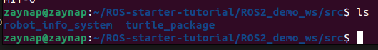
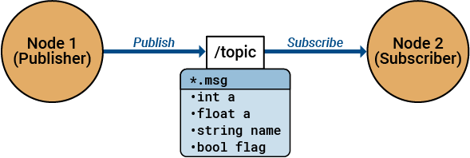
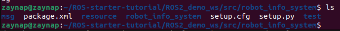
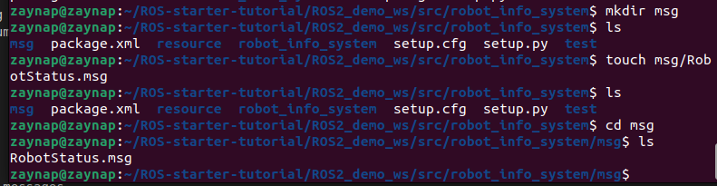

# Robot Info System

This is part 2 of the ROS2 tutorials where we will pick up from where we left off in the previous tutorial and we will apply what we have learned so far in a project to tie everything up and connecting all the information together.

This file will cover the following topics:

1. Creating custom messages
2. Creating custom publisher and subscriber
3. Creating custom services
4. Creating config files
5. Creating launch files

Let's not waste anymore time and get started with our project.

---

## what is our project

This project is all about keeping an eye on the robot’s battery and temperature. Think of it like a health check for your robot!

* It tracks the battery level and temperature.
* It gives a warning if the battery is low or the temperature is too high.
* It lets you reset the battery if it gets too low.
* It sets warning limits so you know when something’s wrong.

Super simple – just a way to make sure the robot stays in good shape!

## lets start

first so we will work on a part of a robot so this part should be done in a package in a workspace to do our work in

### set up the package

move inside the src directory first and then create the pkg

```bash
ros2 pkg create robot_info_system --build-type ament_python --dependencies rclpy std_msgs sensor_msgs
```



#### what does this code do

* **ros2 pkg create**: Tells ROS2 to create a new package.
* **robot_info_system**: Names your package "robot_info_system".
* **--build-type ament_python**:  Specifies that this package is built using Python with the ament build system. This means it’s set up as a Python package, ready for creating and running ROS2 nodes.
* **--dependencies rclpy std_msgs sensor_msgs**: Lists the packages this one depends on (rclpy, std_msgs, sensor_msgs), so they are automatically included.

Now that the package is created, we need to navigate into it. Remember, the package is just a folder containing the necessary libraries and files for ROS2 to work under the hood.

**To move into the package, run:**

```bash
cd robot_info_system 
```

### lets build our project

First, let's think about what we need to do. We want to monitor the **temperature and battery level** of our robot. To do this, we need to get data from sensors that tell us the temperature and battery status. In our system, both values will be represented as **INT numbers**.

Since these two pieces of data don't come in a **standard ROS message**, we have to create a **custom message**. This custom message will let ROS2 know exactly what data to expect (temperature and battery, both as float32) so that our system can understand and work with it.

#### what is the standard ROS message

Standard ROS messages are like ready-made forms for sending data between parts of your robot. Instead of creating your own data format, you can use these pre-built ones. For example, if you need to send a number, you can use the `std_msgs/Float32` message, which is already set up to carry a single floating-point number.



so now lets make our message

### Creating custom messages

so to write our own msgs we should create a folder for the messages

```bash
mkdir msg
```



then create a file for our custom msgs

```bash
touch msg/RobotStatus.msg
```



then open the file and write the message inside it

```bash
nano msg/RobotStatus.msg
```

### task1 :

Develop a custom message called RobotAlert.msg in roboy_info_system_msg package

* Int32 alert_level         # e.g., 1 for low, 2 for medium, 3 for high alert*
* String alert_message      # Alert text (e.g., "Battery Low!")
* Time timestamp  # Time of the alert

### task2:

Develop the Publisher Node:

Create a Python file robot_alert_publisher.py that:

* Initializes a node named robot_alert_publisher.
* Creates a publisher for RobotAlert messages on the topic robot_alert with an appropriate queue size.
* Uses a timer (e.g., every 1 second) to call a function that:
* Creates a new RobotAlert message.
* Fills in the fields (setting the alert message, obtaining the current time for the timestamp).
* Publishes the message.
* Logs the published message details.

### task3:

Write a Python subscriber node that listens to the robot_alert topic, processes incoming RobotAlert messages, and logs the information, including issuing warnings if alert levels exceed a threshold.

Develop the Subscriber Node:

* Create a Python file robot_alert_subscriber.py that:
* Initializes a node named robot_alert_subscriber.
* Creates a subscription to the robot_alert topic for RobotAlert messages.
* In the callback function:

  * Extracts alert_level, alert_message, timestamp, from the received message.
  * Logs the received alert details.
  * SChecks if the alert_level is above a certain threshold and logs a warning if so.

### project task

In this project, we create a comprehensive ROS 2 package that not only controls turtlesim but also assigns each turtle a unique letter. This letter is included in a custom message that is published by a publisher node and processed by a subscriber nod

* **Custom Message Creation:**
  A custom message, named  **TurtleInfo.msg** , is defined to include:

  * **turtle_name (std_msgs/String):** The name of the turtle (e.g., "Turtle_1").
  * **target_coords (geometry_msgs/Point):** The target coordinates (x, y, z) where the turtle should move (with z set to 0 for turtlesim).
  * **letter (std_msgs/String):** A letter that each turtle “writes” as part of its identity (for example, "A").

---

* **Publisher Node (turtle_publisher.py):**
  This node is responsible for sending out the custom message periodically. Its functions include:

  * Initializing a ROS 2 node with a fixed name (e.g., `turtle_publisher`).
  * Creating a publisher that publishes messages of type **TurtleInfo** on the topic `/turtle_info`.
  * Every second, the node publishes a message with the following hardcoded values:
    * **turtle_name:** Set to a fixed value such as "Turtle_1".
    * **letter:** Set to a fixed value such as "A".
    * **target_coords:** Randomly generated coordinates within turtlesim limits (e.g., x and y between 0.0 and 11.0, with z always 0).
  * Logging the details of each published message so that you can verify the correct information (including the turtle's unique letter) is sent out.

  ---
* **Subscriber Node (turtle_subscriber.py):**
  This node handles incoming messages and controls the turtle’s movement accordingly:

  * It initializes a ROS 2 node with a fixed name (e.g., `turtle_subscriber`).
  * It subscribes to the `/turtle_info` topic to receive **TurtleInfo** messages.
  * It also subscribes to `/turtle1/pose` (provided by turtlesim) to obtain the current position of the turtle.
  * In its callback, the node:
    * Extracts the hardcoded turtle name, target coordinates, and letter from the received message.
    * Computes the error between the turtle's current pose and the target coordinates.
    * Uses a simple proportional controller to calculate velocity commands:
      * It computes the angular error (the difference between the turtle’s current heading and the desired heading toward the target).
      * If the angular error is small, it sets a forward (linear) speed proportional to the distance to the target.
    * Publishes a velocity command (using a `geometry_msgs/Twist` message) on `/turtle1/cmd_vel` so that the turtle moves toward the target.
    * Logs the details of the received message and the velocity command for debugging.

auther : zaynap
