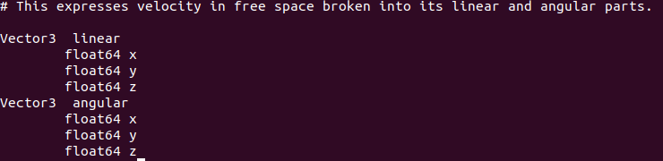

# Robot Operating System (ROS)

This is a quick overview and a small demo on ROS2. members reading this demo are assumed to have basic information about ROS as a concept and how it's used in autonomous systems and robotics in general.

To put it into prespective ROS is just a framework that help us connecting all the various aspects of robotics such as perception, planning and control. In simple terms if you have a robot how do you make the sensors and the main control unit mounted on the robot communicate. here comes ROS to provide us with some tools and libraries to make this communication easy.

The main resource to better understand what is ROS2 and how to get started with it is ROSwiki. here is the link: [https://docs.ros.org/en/humble/](https://docs.ros.org/en/humble/)

> Note that this docs is for ros humble which is the most stable and famous version at the time that this file was written

---

### Sourcing ROS

After you open the wiki and get on with the installation you will notice something important that every time you open a terminal and you want to work with ROS2 you will have to add this command at the start of the terminal session:

```bash
source /opt/ros/humble/setup.bash
```

To save yourself the trouble of writing down this command every time. you can use the **`.bashrc`** file to do it for you.

**`.bashrc`** file is a file that runs once you open a terminal session. for example your home directory have a **`.bashrc`** file with some **bash** code in it that sets up the environment of your machine for you. You can read more about **`.bashrc`** files here if you want: [https://www.digitalocean.com/community/tutorials/bashrc-file-in-linux](https://www.digitalocean.com/community/tutorials/bashrc-file-in-linux)

Anyways all that we need to know is that this file runs once we open a new terminal session and it contains **bash** code (commands are considers bash code). so all we have to do is add our command to the **`.bashrc`** file and we won't bother doing this command every time we open a new shell. But how do we do this.

1. we open a new shell and make sure we are in the home directory.
2. then use this command to open the **`.bashrc`** file.

```bash
gedit .bashrc
```

3. then we add this line at the end of the file and save.

```bash
source /opt/ros/humble/setup.bash
```

There is an alternative way to do this in one step using this command:

```bash
echo "source /opt/ros/humble/setup.bash" >> ~/.bashrc
```

Voila you have sources you ROS for good.

---

### Basics of ROS2

We will start our journey in ROS2 by installing turtlesim since this is the simplest project that will help us grasp all the concepts that we want to discover in this demo.

we will install turtlesim by using this command

```bash
sudo apt install ros-humble-turtlesim
```

To get something running and encourage you to continue this tutorial we can run this:

```bash
ros2 run turtlesim turtlesim_node
```

Ok let's break down this command.

* **ros2** indicates that we are typing a command related to ros2 and every ros command that will use from now on will begin with ros2
* the **run** command lets us run cartain nodes in our workspace
* **turtlesim** is the `name of the package` that has the node that we want to use
* **turtlesim_node** is the `node name` that we ran

ok now propably you have more questions such as what is the meaning of package, workspace and node. Let's discuss these terms briefly and we will come back to the program that we just opened.

**Workspace:** is a directory that have different packages in it. think of it as the container that holds all the different aspects and tools for you project.

**Package:** is a subdirectory in the workspace container that contains different nodes related to on specific job.

**Node:** is the building block of the entire system and it refers to a certain file (script) that is responsibel for a specific task.

Let's take an example to make things more clear. Let's say we want to start a new project on autonomous exploration robot. we will start by creating a workspace to hold everything related to this project (we will learn how to create a workspace later in this demo). after we've created our workspace we need to define the main components of our task for example our robot will have a camera that we will use to identify certain objects. this is perception so we will create a package to hold all files related to perception (we will learn how to create a package later in this demo). another package for mapping, another for environment and robot model, etc. Now let's start working on these packages. We find for example in the planning package that we have a lot of tasks such as local planning, global planning, localization, trajectory, etc. So we will create a node (we will learn how to create a node later in this demo) for each task to focus on it.

Ok now we have a better view of the system so far. but remember what we said before the power of ROS lies in **connecting** and providing **communication** between all these different nodes in the system. so how exactly does ROS helps us with this task. that's what we will learn in the following sections.

---

### Moving the turtle

Now let's continue where we left off. we started turtlesim node and there is a turtel hanging around our screen. how about we make this turtle move. How can we do this you ask. By running another node that is responsible for the movement of the turtle. In another shell run this command

```bash
ros2 run turtlesim turtle_teleop_key
```

Now if you use you arrow keys in your keyboard you will move the turtle. first notice that we ran another node from the same package as the last node which is turtlesim package.

Ok let us understand how does these two nodes work and how are they talk to each other.

There are three main types of communication that ROS provides **topics**, **services**, and **actions.** Let's explain them briefly for now and later we will provide a detailed explaination of each one of them.

#### Topics

is a channel that nodes can send data to and recieve data from. the nodes that sends data to a topic are called **`publishers`** and the nodes that listnes for this data are called **`subscribers`**. A node can have multiple publishers and subscribers.


In our example we used two nodes turtlesim_node and turtle_teleop_key. these two nodes communicate with each other through a topic called cmd_vel. ok how did we know this information and how is this topic enable us to move the robot like that.

In a new terminal run the following command:

```bash
ros2 node list
```

this will list all the active nodes which will result in the two nodes that we already ran before. next we run this command.

```bash
ros2 topic list
```

This will list all the topics that the that these two nodes have created.


here we find the topic that we mentioned before **`cmd_vel`** and when we run the following command:

```bash
ros2 topic info /turtle1/cmd_vel
```

we get this.


which indicates that there is one publisher and one subscriber that are connected to this topic. we also notice the type of the topic which indicate the type of the message that is being transported through this topic.

if you want to learn more about the type of a message we can run this command:

```bash
ros2 interface show geometry_msgs/msg/Twist
```

this will provide us with some information about the message.



ok now we understand what are turtle_teleop_key sending to turtlesim_node. It's sending linear and angular velocities in 3 dimention space.

back to our nodes. If we want to get more inforamtion about a node we can run:

```bash
ros2 node info /turtlesim 
```

This will give us all sorts of information about the node.


we can see here that this node is subscribing to the cmd_vel topic that's why it could connect to the turtle_teleop_key node.

Now that we understand how to run nodes and how they can communicate with each other how about we try giving a direct command to the turtlesim_node through the terminal. Let's try this following command:

```bash
ros2 topic pub --once /turtle1/cmd_vel geometry_msgs/msg/Twist "{linear: {x: 2.0, y: 0.0, z: 0.0}, angular: {x: 0.0, y: 0.0, z: 1.8}}"
```

the pub command let's us publich a message directly to a topic that we choose and we also need to provide the message type and finally the content of the message. we added the **`--once`** flag to only publish one message if we didn't add this flag the command will loop until we stop it.

We should have a better understanding for the topics, publishers, and subscribers by now so let's learn a new tool that ROS provides to help us visualize this process.

---

#### rqt

rqt is a tool that we use to visualize and interact with the different components of the our system.

Let's start by downloading rqt

```bash
sudo apt install '~nros-humble-rqt*'
```

After the installation let's start with a simple command that rqt provides:

```bash
ros2 run rqt_graph rqt_graph
```

this command will open a new window and display to us the active nodes and the topics related to them and what are the publishers and subscribers of each topic.


---

### Spawning new turtle

Now it's time to learn about the second communication method in ROS which is services.

#### Services

Services are the second communication method that is introduced in ROS and it works based on a request and response type. meaning that the client sends a request to the server and the server handles this request and get back with the output to the client. 

Services are less common compared to topics in most cases but there are many situations that it's prefered to use services instead of topics. Let's say for example that we want our robot to perform a certain move for example blink when it sees a red obstacle on an obstacle course. we can create a topic that listens for any obstacles and filter for the red ones and take the action required, but this can be computaionally expensive and time latency may appear. Instead we can create a service that we can only call when a red obstacle is detected. 

Services may still a bit blurry for you but with some practical use, we will get used to it.


